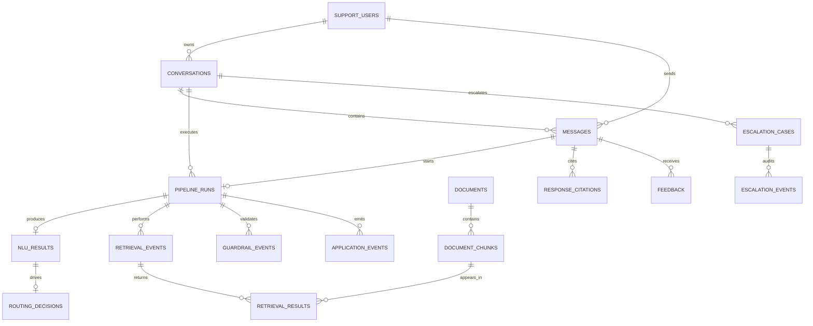

# PI 1: Connected Customer-Support MVP

## Planning objective

Turn the project's existing backend, intent model, document embeddings, escalation
data, and dashboards into one connected customer-support workflow.

This folder is a planning and database-design package. The SQL under `PI_1/sql`
is draft PostgreSQL DDL and is not evidence that the features have been deployed.

By the end of PI 1, a customer message should move through a traceable pipeline:

```text
Customer message
    -> input validation and PII masking
    -> intent/entity classification
    -> route decision
    -> knowledge retrieval
    -> grounded response with citations
    -> output validation
    -> response or human escalation
    -> feedback and operational metrics
```

## Planned features

| Order | Feature | Outcome |
|---|---|---|
| 1 | Conversation Orchestrator | Stateful chat API with conversation logging |
| 2 | NLU and Decision Router | Intent, entity, confidence, and route selection |
| 3 | RAG Retrieval and Citations | Live vector retrieval and grounded answers |
| 4 | Guardrails and Human Handoff | Safe input/output checks and escalation cases |
| 5 | Feedback and Observability | Measurable quality, latency, errors, and feedback |

## Dependency sequence

```text
Feature 1
   |
   v
Feature 2
   |
   v
Feature 3
   |
   v
Feature 4
   |
   v
Feature 5
```

Feature 5 instrumentation should be added throughout development, but its complete
dashboard and reporting work depends on events produced by Features 1-4.

## Planned database architecture



The DDL intentionally uses:

- UUID primary keys for new operational tables
- Text document/chunk IDs for compatibility with the current ingestion code
- `timestamptz` for all operational timestamps
- JSONB for bounded, schema-validated metadata that changes more often than the
  relational core
- Foreign keys and deletion rules for lifecycle integrity
- Partial and composite indexes for queue, trace, conversation, and dashboard reads
- Check constraints for status, role, score, and latency domains

## DDL migration files

| Order | File | Tables and objects |
|---|---|---|
| 1 | `sql/001_conversation_orchestrator.sql` | Users, conversations, messages, pipeline runs, idempotency |
| 2 | `sql/002_nlu_routing.sql` | Routing policies, NLU results, routing decisions |
| 3 | `sql/003_rag_retrieval.sql` | Documents/chunks extensions, retrieval events/results, citations, vector-search function |
| 4 | `sql/004_guardrails_escalation.sql` | Guardrail policies/events, PII detection metadata, escalation cases/events |
| 5 | `sql/005_feedback_observability.sql` | Feedback, application events, evaluation tables, daily metric views |

See [sql/README.md](sql/README.md) for compatibility and execution guidance.
See [DATABASE_SCHEMA.md](DATABASE_SCHEMA.md) for relationships, integrity rules,
deletion behavior, JSON contracts, access control, and migration readiness.

## Cross-feature transaction boundaries

- Store the customer message and initial pipeline run in one transaction.
- Store each external-call result before advancing the run state.
- Create an escalation case and mark the conversation/run escalated atomically.
- Store the assistant message and its citations in one transaction after citation
  validation passes.
- Idempotency records must return the original completed response on safe client
  retries.
- Telemetry may be written independently, but missing telemetry must never change
  the customer-visible decision.

## Data classification

| Classification | Examples | Storage rule |
|---|---|---|
| Public | Published FAQ and policy content | May enter retrieval context |
| Internal | Route reasons, latency, model version | Restricted operational access |
| Sensitive | Customer message, support notes | Store redacted by default |
| Highly sensitive | Payment data, credentials, secrets | Never store in PI-1 tables |

`content_encrypted` is optional and exists only for an approved original-message
retention use case. Encryption keys must not be stored in PostgreSQL or source code.

## PI 1 definition of done

- One API request can execute the complete support pipeline.
- Conversations and messages have stable IDs and are stored.
- Intent and route decisions are visible in the response and audit data.
- Knowledge answers contain valid citations to stored document chunks.
- Unsafe, low-confidence, or unsupported cases are handed to a human.
- Customer feedback and per-stage operational metrics are queryable.
- Automated tests cover successful, no-result, failure, and escalation paths.
- API documentation and local setup instructions reflect the implemented behavior.
- All database changes are reproducible from reviewed migrations.
- Foreign-key, uniqueness, status-transition, and authorization tests pass.
- Migration tests pass against both an empty database and an approved copy of the
  current development schema.

## Delivery checkpoints

| Checkpoint | Required evidence |
|---|---|
| Schema review | DDL reviewed for data lifecycle, PII, indexes, and migration safety |
| API review | OpenAPI contract and error catalog approved |
| Security review | Auth/RBAC, redaction, injection, and escalation tests |
| Quality review | Golden-set intent, retrieval, citation, and escalation results |
| Operations review | Trace lookup, dashboards, alerts, and recovery procedure |
| Release review | Backward compatibility, rollback plan, and Railway smoke test |

## Not included in PI 1

These architecture items are intentionally deferred to later increments:

- Production order, refund, CRM, and ticket-provider integrations
- Full MCP gateway
- Multi-agent workflows
- Multilingual support
- Multi-tenant enterprise RBAC
- Automated refund approval
- SOC 2 and enterprise governance controls
