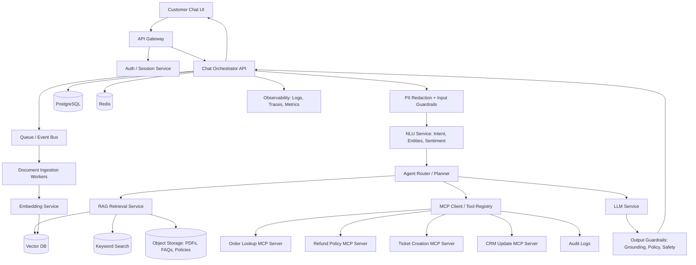
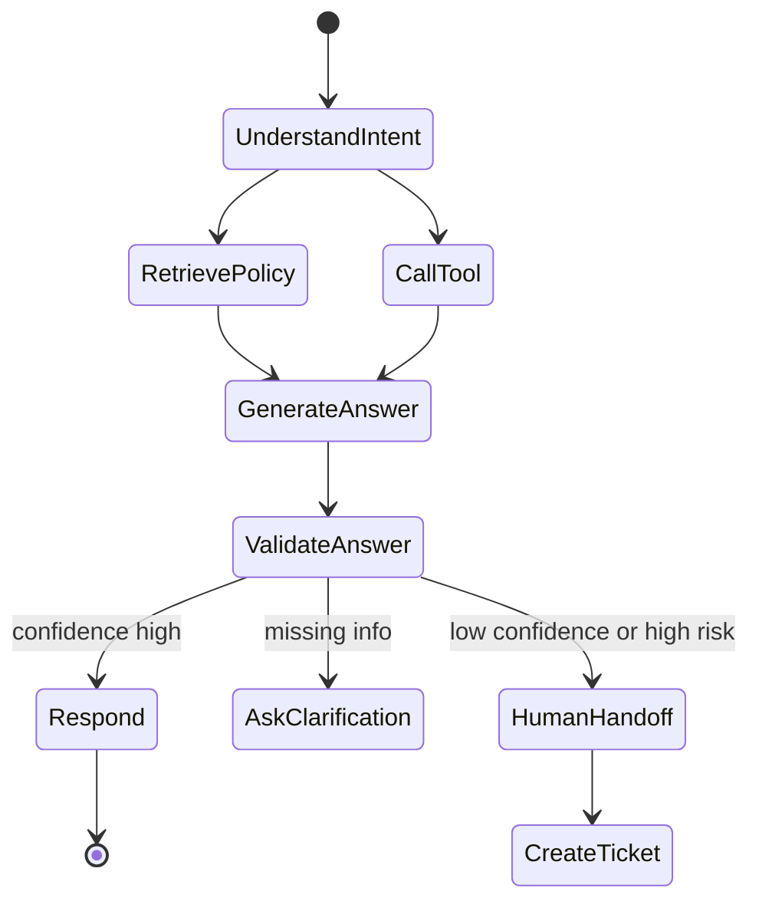

# Customer Support AI Chatbot

An end-to-end AI system design for a customer support chatbot built for SaaS or e-commerce support teams. The chatbot understands customer messages, classifies intent, retrieves company-specific knowledge, answers with citations, calls business tools, creates support tickets, and escalates risky or unresolved cases to humans.

## Problem Statement

Customer support teams handle large volumes of repetitive and time-sensitive requests across billing, refunds, orders, technical issues, account access, and general FAQs. This project designs a governed AI support platform that combines ML classification, NLP entity extraction, RAG, LLM response generation, MCP-based tool calling, guardrails, observability, and human handoff.

The system should support intents such as:

| Intent | Example |
| --- | --- |
| Billing | Why was I charged twice? |
| Refund | I want my money back. |
| Order status | Where is order #12345? |
| Technical issue | The app keeps crashing. |
| Account access | I cannot log in. |
| General FAQ | What is your return policy? |

## Goals

### Business Goals

| Goal | Metrics |
| --- | --- |
| Reduce support workload | Deflection rate, automated resolution rate |
| Improve customer experience | CSAT, first response time |
| Reduce unnecessary escalations | Human handoff rate |
| Improve policy consistency | Grounded answer rate, citation coverage |

### AI and Technical Metrics

| Area | Metrics |
| --- | --- |
| Intent classification | Accuracy, F1, confidence calibration |
| Retrieval | Recall@K, Precision@K, MRR, NDCG |
| Answer quality | Faithfulness, groundedness, answer relevance |
| Safety | Hallucination rate, policy violation rate |
| Agent execution | Tool success rate, task completion rate |
| Performance | P95 latency, uptime, error rate |
| Cost | Cost per conversation, tokens per resolved case |

## User Personas

| Persona | Needs |
| --- | --- |
| Customer | Fast, accurate answers and help with orders, refunds, billing, and account access |
| Support Agent | Escalated tickets with full conversation context and AI summaries |
| Support Manager | CSAT, resolution rate, SLA, escalation, and unresolved-topic reporting |
| Admin | Manage documents, prompts, tools, thresholds, and policies |
| Developer | Integrate APIs, MCP tools, monitoring, and deployment pipelines |
| Security and Audit Team | PII handling, access logs, tool-call audit trails |
| Legal and Compliance | Policy enforcement, refund limits, approved wording |

## Functional Requirements

### Customer Features

| Feature | Description |
| --- | --- |
| Chat interface | Web, mobile, or embedded support widget |
| Intent detection | Billing, refund, order, technical issue, account access, FAQ |
| Entity extraction | Order ID, product name, invoice ID, account email |
| FAQ answering | Answers from indexed help docs and policy documents |
| Order lookup | Calls order APIs using authenticated customer context |
| Refund guidance | Checks refund policy before responding |
| Ticket creation | Creates Zendesk, Freshdesk, or Salesforce Service Cloud tickets |
| Human handoff | Escalates low-confidence, sensitive, or unresolved issues |
| Multiturn memory | Maintains session state during the conversation |

### Admin Features

| Feature | Description |
| --- | --- |
| Document upload | Upload FAQ PDFs, policy docs, and troubleshooting guides |
| Ingestion dashboard | Track parsing, chunking, embedding, and indexing status |
| Prompt management | Version prompts and response templates |
| Threshold management | Configure confidence and escalation thresholds |
| Tool permissions | Enable or disable tools by role and risk level |
| Analytics dashboard | Track CSAT, unresolved topics, hallucinations, and tool failures |

## Non-Functional Requirements

| Category | Requirement |
| --- | --- |
| Latency | P95 under 3-5 seconds for FAQ answers; tool flows may be slower |
| Availability | 99.9%+ for production support |
| Scalability | Handle seasonal spikes and concurrent chats |
| Security | OAuth/OIDC, RBAC, encryption, and secrets management |
| Privacy | PII redaction, retention policy, deletion support |
| Reliability | Retries, fallbacks, circuit breakers, dead-letter queues |
| Compliance | GDPR, CCPA, and SOC 2-ready auditability |
| Observability | Logs, traces, prompt logs, retrieval traces, and tool traces |
| Maintainability | Modular services, versioned prompts, versioned datasets |
| Cost control | Model routing, caching, retrieval optimization |

## High-Level Architecture



## End-to-End Request Flow

Example customer message:

```text
I want a refund for order #12345. This is ridiculous.
```

1. API Gateway validates session and applies rate limits.
2. PII guardrail masks sensitive data when needed.
3. NLU service extracts intent, entities, sentiment, and urgency.
4. Router decides whether to retrieve knowledge, call a tool, ask a clarification question, or escalate.
5. RAG service retrieves relevant refund policy passages.
6. Agent calls the order lookup tool.
7. Agent checks refund eligibility using policy and order metadata.
8. LLM generates a grounded response using approved wording.
9. Output guardrails verify citations, policy compliance, and PII safety.
10. If eligible, the bot explains next steps or creates a ticket.
11. If confidence is low or the case is sensitive, the bot escalates to a human.
12. Conversation data, retrieval context, model response, tool calls, and audit logs are stored.

## Decision Logic

### Intent Classification Pipeline

```text
User Message
-> Text Cleaning
-> Tokenization
-> Entity Extraction
-> Sentiment Detection
-> Intent Classification
-> Confidence Scoring
-> Routing Decision
```

### Example Intent Categories

```python
INTENTS = [
    "billing_issue",
    "refund_request",
    "order_status",
    "technical_issue",
    "account_access",
    "product_question",
    "shipping_question",
    "human_agent_request",
    "unknown",
]
```

### Confidence Thresholds

| Condition | Action |
| --- | --- |
| Intent confidence >= 0.85 | Continue automated flow |
| Intent confidence 0.65-0.85 | Ask clarification or use RAG cautiously |
| Intent confidence < 0.65 | Escalate or ask clarification |
| Negative sentiment plus refund/billing | Prioritize or escalate if unresolved |
| Policy confidence low | Do not promise; create ticket |
| Tool failure | Retry, then escalate |
| Legal, fraud, chargeback, VIP account | Human handoff |

### Composite Confidence Score

```text
final_confidence =
  0.25 * intent_confidence +
  0.25 * retrieval_relevance +
  0.20 * answer_groundedness +
  0.15 * tool_success_score +
  0.15 * policy_risk_score
```

Routing example:

```text
final_confidence >= 0.80 -> answer automatically
0.60-0.79 -> answer with caveat or ask clarification
< 0.60 -> escalate to human
```

## LLM Design

| Task | Recommended Model Type |
| --- | --- |
| Intent classification | Lightweight ML classifier or small LLM |
| Entity extraction | spaCy, transformer NER, or structured LLM output |
| FAQ answer generation | LLM with RAG context |
| Tool planning | Function-calling capable LLM |
| Summarization | Smaller low-cost LLM |
| Safety review | Rule-based and model-based guardrail |

### Prompt Structure

```text
System:
You are a customer support assistant.
Only answer using approved company policy or verified tool results.
Never promise refunds, credits, cancellations, or account changes unless a tool confirms eligibility.
Escalate when confidence is low.

Developer:
Use the provided context and tool results.
Return JSON with:
- response
- intent
- confidence
- citations
- next_action
- escalation_required
```

### Structured Output Example

```json
{
  "intent": "refund_request",
  "confidence": 0.87,
  "response": "I found your order and checked our refund policy...",
  "citations": ["refund_policy_v3.pdf#chunk_12"],
  "next_action": "create_ticket",
  "escalation_required": false
}
```

## RAG Design

### Document Ingestion

```text
Upload FAQ / PDF / policy doc
-> Virus scan
-> Parse text
-> Extract metadata
-> Chunk document
-> Generate embeddings
-> Store chunks in vector DB
-> Store original file in object storage
-> Index metadata in PostgreSQL
```

### Chunking Strategy

| Document Type | Chunking |
| --- | --- |
| FAQ | One Q&A pair per chunk |
| Refund policy | Section-based chunks |
| Troubleshooting guide | Step-based chunks |
| Legal/compliance docs | Smaller chunks with strict metadata |
| Product docs | Heading-aware chunks |

Recommended defaults:

```text
Chunk size: 400-800 tokens
Overlap: 50-120 tokens
Top-K retrieval: 5-10
Rerank top: 20 -> final 5
```

Retrieval should use hybrid search:

```text
Semantic vector search + keyword/BM25 search + metadata filters + reranking
```

Metadata example:

```json
{
  "doc_type": "refund_policy",
  "product": "premium_plan",
  "region": "US",
  "effective_date": "2026-01-01",
  "access_level": "public",
  "version": "v3"
}
```

To reduce hallucinations, the bot should answer only from retrieved context or verified tool results, cite source chunks, refuse or escalate when policy evidence is missing, and avoid using model memory for company-specific policies.

## Agentic AI Design

Use a stateful agent graph for reliable, auditable workflows.

| Component | Responsibility |
| --- | --- |
| Planner | Understand task and choose workflow |
| Router | Decide RAG vs tool call vs escalation |
| Retriever Agent | Fetch policy and help context |
| Tool Agent | Call order, ticket, CRM, and refund tools |
| Validation Agent | Check grounding, citations, and policy compliance |
| Handoff Agent | Summarize issue for human support |
| Memory Manager | Maintain session and customer context |



## MCP Tool Design

MCP standardizes how the LLM application connects to business tools and data sources through schema-defined servers.

| MCP Server | Tools |
| --- | --- |
| FAQ Search Server | `search_faq`, `get_policy_chunk` |
| Order Server | `get_order_status`, `get_delivery_eta` |
| Refund Server | `check_refund_eligibility`, `start_refund_case` |
| Ticket Server | `create_ticket`, `update_ticket` |
| CRM Server | `get_customer_profile`, `update_customer_notes` |

### Example Tool Schema

```json
{
  "name": "create_support_ticket",
  "description": "Create a support ticket for unresolved customer issue.",
  "input_schema": {
    "type": "object",
    "properties": {
      "customer_id": { "type": "string" },
      "intent": { "type": "string" },
      "priority": {
        "type": "string",
        "enum": ["low", "normal", "high", "urgent"]
      },
      "summary": { "type": "string" },
      "conversation_id": { "type": "string" }
    },
    "required": ["customer_id", "intent", "summary", "conversation_id"]
  }
}
```

### Tool Safety Rules

| Tool | Risk | Control |
| --- | --- | --- |
| Order lookup | Low | Authenticated customer only |
| FAQ search | Low | Public docs only |
| Ticket creation | Medium | Rate limit and audit |
| Refund initiation | High | Eligibility check plus approval |
| Account update | High | Human approval required |

## Memory Design

| Memory Type | Purpose | Storage |
| --- | --- | --- |
| Short-term memory | Current conversation state | Redis / session store |
| Conversation memory | Full message history | PostgreSQL |
| User preference memory | Language, preferred channel | PostgreSQL |
| Task memory | Open ticket, refund, or order flow state | PostgreSQL |
| Vector memory | Prior resolved issues and summaries | Vector DB |
| Audit memory | Tool calls and approvals | Immutable audit log |

Privacy rules:

```text
Do not store raw payment data.
Mask PII in logs.
Allow user data deletion.
Expire inactive sessions.
Separate customer-visible memory from internal agent traces.
```

## Database Design

Core tables:

| Table | Purpose |
| --- | --- |
| `users` | Customer, admin, agent, and auditor identity records |
| `conversations` | Conversation lifecycle, channel, and status |
| `messages` | User, bot, and agent messages with redacted content |
| `documents` | Uploaded FAQs, policies, guides, and ingestion status |
| `document_chunks` | Parsed chunks, metadata, and vector references |
| `agent_runs` | Intent, confidence, routing decision, and latency |
| `tool_calls` | Sanitized tool input/output, status, and audit metadata |
| `feedback` | Rating, comment, and resolution status |

Recommended indexes:

```sql
CREATE INDEX idx_messages_conversation_id ON messages(conversation_id);
CREATE INDEX idx_documents_doc_type ON documents(doc_type);
CREATE INDEX idx_agent_runs_intent ON agent_runs(intent);
CREATE INDEX idx_tool_calls_tool_name ON tool_calls(tool_name);
CREATE INDEX idx_feedback_rating ON feedback(rating);
```

## API Design

### Chat API

```http
POST /api/v1/chat/message
Authorization: Bearer <token>
```

Request:

```json
{
  "conversation_id": "conv_123",
  "message": "Where is my order #12345?"
}
```

Response:

```json
{
  "message": "Your order is currently in transit...",
  "intent": "order_status",
  "confidence": 0.91,
  "citations": [],
  "tool_calls": ["get_order_status"],
  "escalation_required": false
}
```

### Document Upload API

```http
POST /api/v1/documents/upload
```

```json
{
  "title": "Refund Policy",
  "doc_type": "policy",
  "version": "v3"
}
```

### Search API

```http
POST /api/v1/search
```

```json
{
  "query": "refund eligibility after 30 days",
  "filters": {
    "doc_type": "policy",
    "region": "US"
  },
  "top_k": 5
}
```

### Ticket API

```http
POST /api/v1/tickets
```

```json
{
  "conversation_id": "conv_123",
  "priority": "high",
  "summary": "Customer requested refund for damaged item.",
  "handoff_reason": "Negative sentiment and policy exception"
}
```

### Feedback API

```http
POST /api/v1/feedback
```

```json
{
  "conversation_id": "conv_123",
  "rating": 4,
  "resolved": true,
  "comment": "Helpful response"
}
```

## Security and Governance

| Area | Design |
| --- | --- |
| Authentication | OAuth/OIDC, JWT, session validation |
| Authorization | RBAC for customer, support agent, admin, auditor |
| Data isolation | Tenant ID on every row for B2B SaaS |
| Encryption | TLS in transit, AES-256 at rest |
| Secrets | Cloud secret manager; no secrets in prompts |
| PII handling | Redaction before logs and model calls where possible |
| Prompt injection defense | Detect instructions that attempt to override policy |
| Tool permissions | Tool allowlist by user role and risk level |
| Human approval | Required for refunds, account changes, and credits |
| Auditability | Store tool calls, approvals, prompt versions, and model versions |
| Compliance | Retention, deletion, export, and consent workflows |

## AI Safety and Guardrails

### Input Guardrails

```text
Detect prompt injection
Detect abusive content
Detect PII/secrets
Detect fraud/legal/chargeback topics
Detect human-agent request
```

### Output Guardrails

```text
Verify answer is grounded in retrieved context
Verify citations support claims
Block unsupported refund promises
Block hallucinated policy details
Redact sensitive customer information
Escalate high-risk cases
```

### Escalation Triggers

| Trigger | Reason |
| --- | --- |
| Confidence below threshold | Avoid wrong answer |
| No relevant policy found | Avoid hallucination |
| Customer asks for legal action | Human/legal review |
| Refund exception | Requires approval |
| Authentication failure | Cannot expose account data |
| Repeated user frustration | Protect CSAT |
| Tool failure | Agent cannot verify facts |

## Evaluation Plan

### Offline Evaluation

Create a golden dataset with 500-2,000 historical support questions containing expected intent, entities, answer, source document, and escalation decision.

| Component | Metrics |
| --- | --- |
| Intent classifier | Accuracy, precision, recall, F1 |
| Entity extraction | Entity-level precision and recall |
| Retrieval | Recall@K, Precision@K, MRR, NDCG |
| Generation | Faithfulness, groundedness, answer relevance |
| Agent workflow | Task completion rate, tool success rate |
| Escalation | False escalation, missed escalation |
| Safety | Hallucination rate, policy violation rate |

### Online Evaluation

| Metric | Target |
| --- | --- |
| CSAT | > 4.2 / 5 |
| Automated resolution rate | 40-70%, depending on maturity |
| Hallucination rate | < 1-2% for customer-facing answers |
| P95 latency | < 5 seconds for normal FAQ flow |
| Tool success rate | > 98% |
| Human handoff quality | Agent accepts AI summary with minimal edits |

## Observability

Track every step of the conversation and agent execution:

```text
conversation_id
user_id / tenant_id
intent
confidence
retrieved_chunks
prompt_version
model_name
token_count
latency
tool_calls
tool_failures
escalation_reason
user_feedback
```

Recommended dashboards:

| Dashboard | Metrics |
| --- | --- |
| Support Operations | Deflection, CSAT, escalations |
| AI Quality | Hallucination, groundedness, feedback |
| RAG | Retrieval hit rate, Recall@K, empty results |
| Tools | Tool latency, failures, retries |
| Cost | Tokens, cost per conversation, model usage |
| Security | Prompt injection attempts, blocked tool calls |

## Recommended Repository Structure

```text
customer-support-ai/
  apps/
    web-chat/
    admin-console/
  services/
    chat-orchestrator/
    nlu-service/
    rag-service/
    ingestion-service/
    mcp-gateway/
    evaluation-service/
  infra/
    terraform/
    k8s/
    helm/
  prompts/
    support_agent/
    escalation_agent/
  evals/
    golden_datasets/
    test_suites/
```

## Technology Stack

### Low-Cost MVP

| Layer | Choice |
| --- | --- |
| UI | Streamlit or Next.js |
| Backend | FastAPI |
| ML/NLP | scikit-learn, spaCy, Hugging Face |
| RAG | LlamaIndex or LangChain |
| Vector DB | FAISS, Chroma, Qdrant |
| DB | PostgreSQL |
| Cache | Redis |
| Queue | Celery/RQ |
| LLM | Provider API or local model |
| Monitoring | OpenTelemetry and Grafana |
| Evaluation | RAGAS and custom golden tests |

### Enterprise

| Layer | Choice |
| --- | --- |
| UI | React / Next.js |
| API | FastAPI, NestJS, or Spring Boot |
| Auth | Auth0, Okta, Azure AD |
| Database | PostgreSQL, Cloud SQL, Aurora |
| Vector DB | Pinecone, Weaviate, Qdrant, Azure AI Search |
| Search | OpenSearch / Elasticsearch |
| Queue | Kafka, Pub/Sub, SQS |
| Object Storage | S3, GCS, Azure Blob |
| Agent Orchestration | LangGraph |
| MCP | MCP SDK and internal MCP servers |
| Ticketing | Zendesk, Freshdesk, Salesforce Service Cloud |
| Observability | OpenTelemetry, Datadog, Grafana |
| Governance | Audit logs, approval workflows, policy engine |

## Scalability Plan

| User Scale | Design |
| --- | --- |
| 100 users | Single FastAPI app, Postgres, local vector DB |
| 1,000 users | Separate chat, RAG, and ingestion services; Redis cache |
| 10,000 users | Kubernetes, managed vector DB, queue-based ingestion |
| 100,000+ users | Multi-region, autoscaling, sharded tenants, model routing, CDN, async workflows |

Scaling techniques:

```text
Cache frequent FAQ answers
Batch embeddings
Use smaller models for simple intents
Use larger models only for complex cases
Precompute document embeddings
Use hybrid search with metadata filters
Rate limit tool calls
Queue long-running tasks
Use circuit breakers for external APIs
```

## Failure Handling

| Failure | Handling |
| --- | --- |
| LLM timeout | Retry, fallback model, escalate |
| Vector DB down | Fallback to keyword search |
| Ticket API down | Queue ticket creation and notify user |
| Order API failure | Retry, then escalate |
| Embedding failure | Send to dead-letter queue |
| Ingestion failure | Mark document failed and alert admin |
| Prompt injection detected | Block instruction and continue safely |
| High latency | Use cached answer or smaller model |
| Cost spike | Rate limits, model downgrade, alert |
| Database outage | Read replica and backup restore plan |

## Roadmap

### MVP

```text
Chat UI
Intent classification
FAQ RAG
Basic escalation
Zendesk ticket creation
Conversation logging
Admin document upload
```

### Version 1

```text
Order lookup
Refund-policy checker
Sentiment detection
Citation validation
Feedback collection
RAG evaluation suite
Dashboard
```

### Version 2

```text
MCP tool gateway
Multi-agent workflow
Human approval for refunds
CRM integration
Multilingual support
Advanced analytics
```

### Enterprise Version

```text
Multi-tenant architecture
RBAC and audit logs
SOC 2 controls
PII governance
Policy versioning
Canary prompt deployment
Advanced evaluation and red-teaming
```

## Implementation Steps

1. Build intent classifier using historical support tickets.
2. Build document ingestion pipeline for FAQs, policies, and help docs.
3. Implement RAG retrieval with citations.
4. Add LLM response generation with structured output.
5. Add tool-calling layer for order lookup and ticket creation.
6. Add escalation logic using confidence thresholds.
7. Add guardrails for grounding, PII, and prompt injection.
8. Add observability, feedback, and evaluation dashboards.
9. Run offline golden-set evaluation.
10. Launch with human-in-the-loop review before full automation.

## Deployment Rules

Branch and deployment governance is documented in [DEPLOYMENT_RULES.md](DEPLOYMENT_RULES.md).

Summary:

| Target Branch | Allowed Source Branch | Approval |
| --- | --- | --- |
| `develop` | `feature/*` | Repository owner approval required |
| `main` | `develop` | Repository owner approval required |

The GitHub Actions workflow in `.github/workflows/deployment.yml` validates pull request branch direction and contains placeholders for development and production deployments.

## Interview Summary

This project is more than an LLM that answers support questions. It is a governed AI support platform where ML classifies intent, RAG grounds answers in company knowledge, agents perform controlled business actions, MCP standardizes tool access, guardrails prevent unsafe behavior, and observability continuously measures quality, safety, latency, and cost.

## References

- [Model Context Protocol](https://modelcontextprotocol.io/)
- [RAGAS metrics](https://docs.ragas.io/en/stable/concepts/metrics/available_metrics/)
- [LangGraph](https://github.com/langchain-ai/langgraph)
- [Zendesk Tickets API](https://developer.zendesk.com/api-reference/ticketing/tickets/tickets/)
